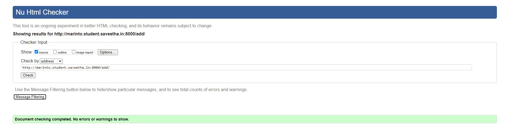
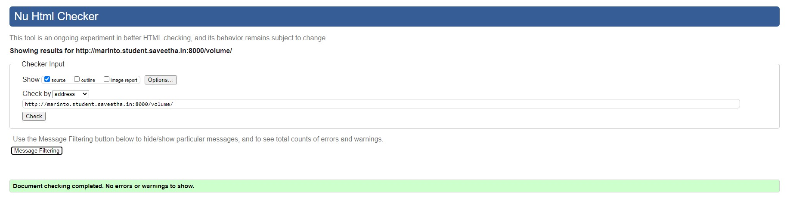
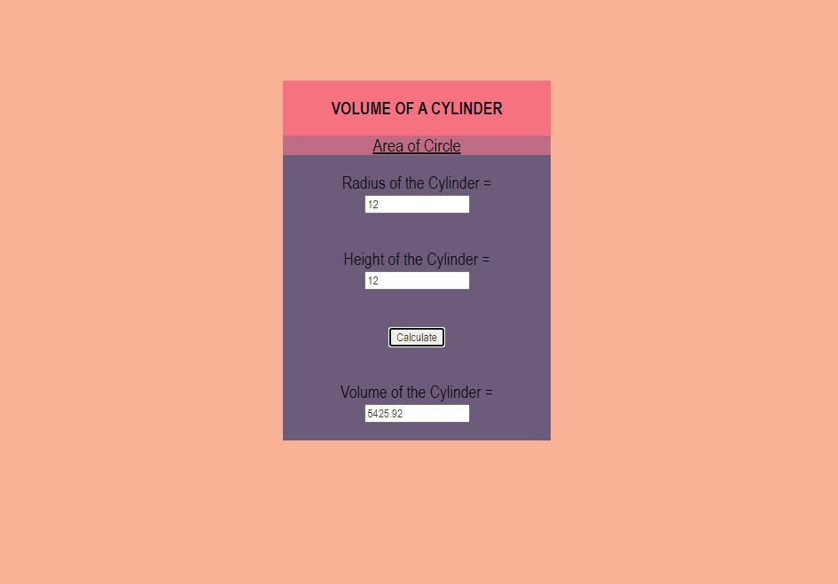

# Mathematical Calculations using JavaScript
## AIM:
To design a website to calculate the area of a circle and volume of a cylinder using JavaScript.

## DESIGN STEPS:
### Step 1: 
Requirement collection.
### Step 2:
Creating the layout using HTML and CSS.
### Step 3:
Write JavaScript to perform calculations.
### Step 4:
Choose the appropriate style and color scheme.
### Step 5:
Validate the layout in various browsers.
### Step 6:
Validate the HTML code.
### Step 7:
Publish the website in the given URL.


## PROGRAM:
### AREACIRCLE.HTML:
```

<!DOCTYPE html>

<html lang="en">

<head>
    <title>MATHEMATICAL OPERATIONS</title>
    <link rel="stylesheet" href="">

</head>


<body>
    <div class="container">
        <div class="formview">
            <div class="banner">
                AREA OF A CIRCLE
            </div>
            <div class="menu">
                <div class="menuitem"><a href="/volume/">Volume of Cylinder</a></div>
            </div>
            <div class="content">
                <form action="add" method="GET">
                    
                    <div class="forminput">
                        <label for="radius">Radius of the Circle =</label>
                        <input type="text" name="radius" id="radius">
                    </div>
                    <div class="forminput">
                        <button type="button" name="button_add" id="button_add">Calculate</button>
                    </div>
                    <div class="forminput">
                        <label for="radius">Area of the Circle =</label>
                        <input type="text" name="result" id="result" readonly>
                    </div>

                </form>
            </div>
        </div>
    </div>
    <script src="/static/js/script.js"></script>
</body>

</html>
```
### VOLUMECIRCLE.HTML
```


<!DOCTYPE html>

<html lang="en">

<head>
    <title>MATHEMATICAL OPERATIONS</title>
    <link rel="stylesheet" href="">

</head>


<body>
    <div class="container">
        <div class="formview">
            <div class="banner">
                VOLUME OF A CYLINDER
            </div>
            <div class="menu">
                <div class="menuitem"><a href="/add/">Area of Circle</a></div>
            </div>
            <div class="content">
                <form action="volume" method="GET">
                    
                    <div class="forminput">
                        <label for="radiusc">Radius of the Cylinder =</label>
                        <input type="text" name="radiusc" id="radiusc">
                    </div>
                    <div class="forminput">
                        <label for="height">Height of the Cylinder =</label>
                        <input type="text" name="height" id="height">
                    </div>
                    <div class="forminput">
                        <button type="button" name="button_vol" id="button_vol">Calculate</button>
                    </div>
                    <div class="forminput">
                        <label for="resultvol">Volume of the Cylinder =</label>
                        <input type="text" name="resultvol" id="resultvol" readonly>
                    </div>

                </form>
            </div>
        </div>
    </div>
    <script src="/static/js/script2.js"></script>
</body>

</html>
```
### SCRIPT.CSS:
```*{
      box-sizing: border-box;
      font-family: 'Arial Narrow';
      color: #0b0c10;
      
}
.menuitem{
    font-size: 20px;
    background-color: #C06C84   ;
    text-align: center;
}

body,html{
    padding: 0px;
    color: #6C5B7B ;
    background-color: #F8B195     ;

}
.container{
    width: 80%;
    margin-left: auto;
    margin-right: auto;
}

.formview{
    justify-content: center;
    margin-top:100px; 
    margin-left: 30%;
    margin-right: 30%;

}

.forminput{
    height: 5%;
    padding: 20px;
    font-size: larger;
}

.banner{
    display: block;
    width: 100%;
    font-size: 40px;
    background-color: #F67280;
    padding: 20px;
    text-align: center;
    font-weight:bold;
    font-size: larger;
    height: 20%;
}

.content{
    
    width: 100%;
    background-color:#6C5B7B   ;
    text-align: center;
}

input{
    color: #4E3C14;
}
button{
    color: #4E3C14;
}
```
### SCRIPT.JS:
```

b1= document.querySelector("#button_add");
b1.addEventListener('click',function re(){
    radius=document.querySelector("#radius");
    result=document.querySelector("#result");
    let r;
    r=3.14*radius.value*radius.value;
    result.value = r;
});

```
### SCRIPT2.JS:
```

b2= document.querySelector("#button_vol");
b2.addEventListener('click',function re2(){
    radius2=document.querySelector("#radiusc");
    height=document.querySelector("#height");
    resultvol=document.querySelector("#resultvol");
    let r2;
    r2=3.14*parseFloat(radius2.value)*parseFloat(radius2.value)*parseFloat(height.value);
    resultvol.value = r2;
});

```
## CODE VALIDATION:




## OUTPUT:




## RESULT:
Thus a website is designed for Mathematical Operations and is hosted in the
URL http://marinto.student.saveetha.in:8000/add/. HTML code is validated.